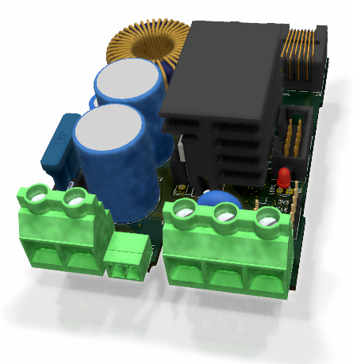

# MPPT charge controller for DIN rail mounting

 First prototype tested, but issues should still be expected.

Schematic: [PDF file](https://github.com/LibreSolar/mppt-2420-rc/raw/master/build/mppt-2420-rc_schematic.pdf)

Bill of Materials: [CSV file](build/mppt-2420-rc_bom.csv) or [interactive HTML BOM](https://libre.solar/mppt-2420-rc/build/mppt-2420-rc_ibom.html)

## Concept description

This charge controller is mainly developed to test the following features:

- Very compact and modular housing design for DIN rail mounting
- Thermal performance and maximum heat dissipation via internal heat sinks
- Performance of the internal OpAmp of the STM32G431 MCU for current measurement
- Dump-load control for small wind turbines using the existing PV reverse blocking MOSFET

## Features

- Solar/Wind input terminal
    - Max. 80V (100V MOSFETs used)
    - DC/DC converter inductor current max. 20A
- Battery output terminal
    - 10 V - 32 V (supporting 12 V and 24 V battery systems)
    - Max. current: 20A (limited by inductor current)
- New STM32G431 ARM MCU with advanced digital power conversion features
- Expandable via Olimex Universal Extension Connector (UEXT)
- Only single LED as power indicator. Additional user interface can be included in separate PCB in front panel housing and connected via UEXT
- CAN interface via RJ45 connectors
- Optional external temperature sensor (10k NTC)
- DIN rail mounting using Phoenix Contact BC series housing
